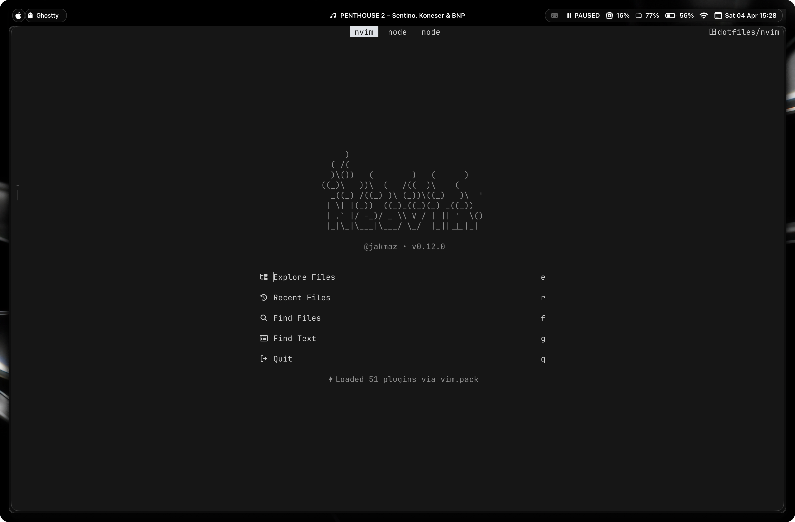

# dotfiles

Personal configuration files for macOS



## Setup

1. **Clone the repository:**

   ```bash
   git clone https://github.com/jakmaz/dotfiles.git ~/git/dotfiles
   ```

2. **Create symlinks for configuration files:**

   ```bash
      ln -s ~/git/dotfiles/gitconfig ~/.gitconfig
      ln -s ~/git/dotfiles/nvim ~/.config/nvim
      ln -s ~/git/dotfiles/zshrc ~/.zshrc
      ln -s ~/git/dotfiles/oh-my-zsh-custom ~/.oh-my-zsh/custom
      ln -s ~/git/dotfiles/p10k.zsh ~/.p10k.zsh
      ln -s ~/git/dotfiles/aerospace ~/.config/aerospace
      ln -s ~/git/dotfiles/sketchybar ~/.config/sketchybar
      ```

## Contents

- **gitconfig**: Global Git configuration
- **nvim**: Neovim configuration files
- **zshrc**: Zsh shell configuration
- **oh-my-zsh-custom**: Custom themes and plugins for Oh My Zsh
- **p10k.zsh**: Powerlevel10k theme configuration for Zsh
- **aerospace**: Configuration for Aerospace tiling application
- **sketchybar**: Configuration for SketchyBar macOS menu bar customization

## Usage

Make any changes directly in the `dotfiles` repository and commit them. Use symlinks to keep these configurations active on your system.
