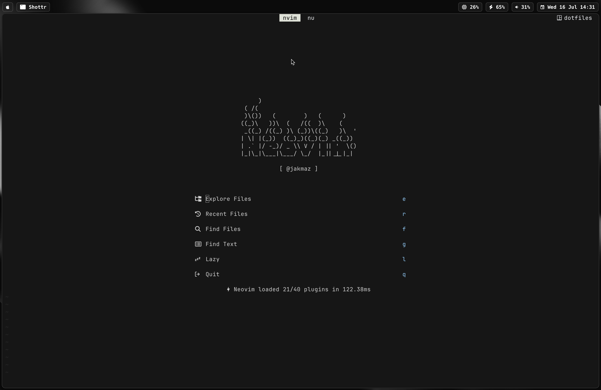

# dotfiles

Personal configuration files for macOS



## Setup

1. **Clone the repository:**

   ```bash
   git clone https://github.com/jakmaz/dotfiles.git ~/git/dotfiles
   ```

2. **Use GNU Stow to create symlinks:**

   ```bash
   cd ~/git/dotfiles
   stow .
   ```

   This command will automatically symlink all configuration files into their correct locations based on the `.stowrc` settings.

3. **Configure Hammerspoon (if using):**

   After stowing the dotfiles, you need to tell Hammerspoon to use the configuration file from the `.config` directory:

   ```bash
   defaults write org.hammerspoon.Hammerspoon MJConfigFile "~/.config/hammerspoon/init.lua"
   ```

## Contents

- **aerospace**: Configuration for Aerospace tiling window manager
- **atuin**: Configuration for Atuin shell history sync
- **ghostty**: Configuration for Ghostty terminal emulator with custom shaders
- **gitconfig**: Global Git configuration
- **hammerspoon**: Lua configuration for Hammerspoon macOS automation
- **karabiner**: Configuration for Karabiner-Elements key remapping
- **nushell**: Configuration files for Nushell modern shell
- **nvim**: Neovim configuration with lazy.nvim plugin manager
- **opencode**: Configuration for OpenCode AI assistant
- **sesh**: Configuration for Sesh session manager
- **sketchybar**: Configuration for SketchyBar macOS menu bar customization
- **tmux**: Configuration for tmux terminal multiplexer
- **yabai**: Configuration for yabai tiling window manager
- **yazi**: Configuration for Yazi file manager
